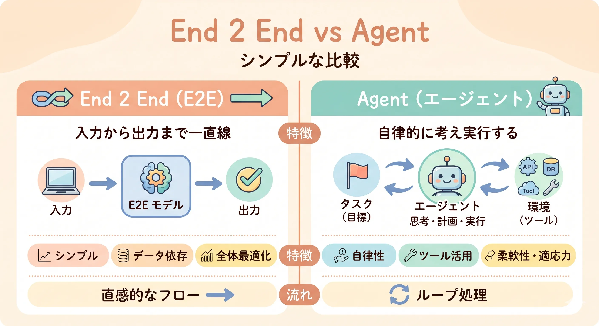
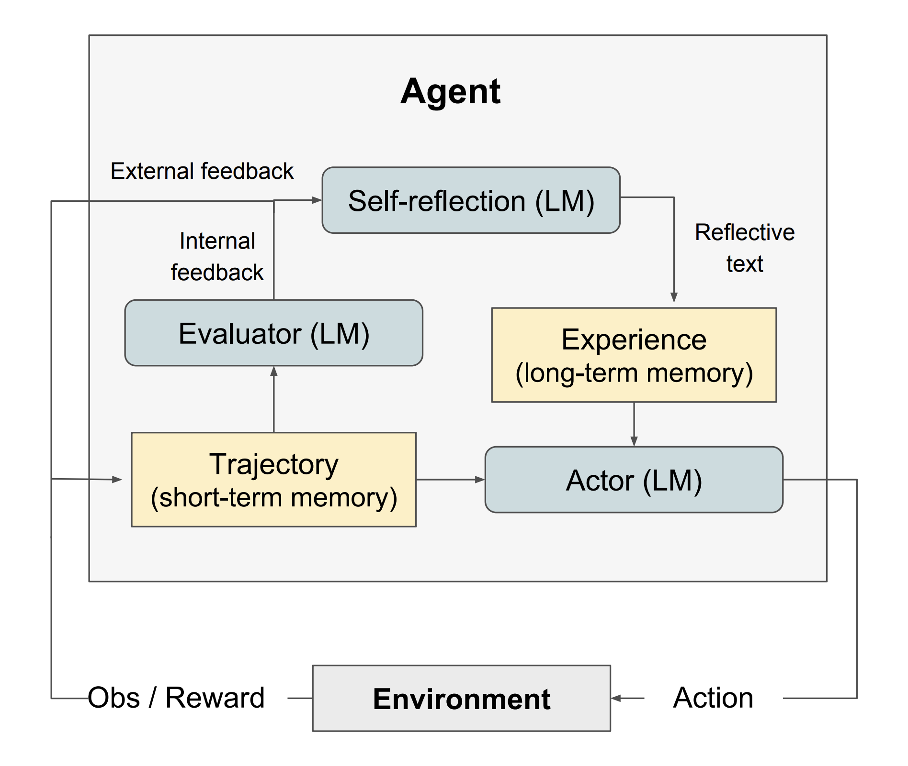
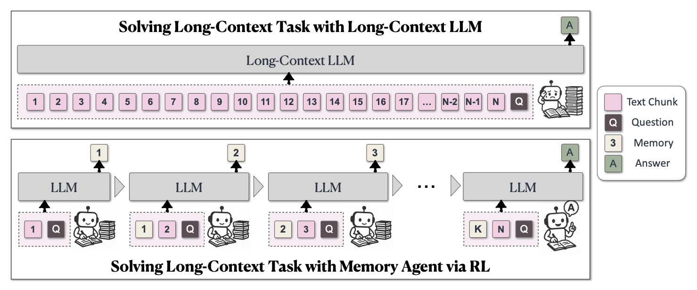
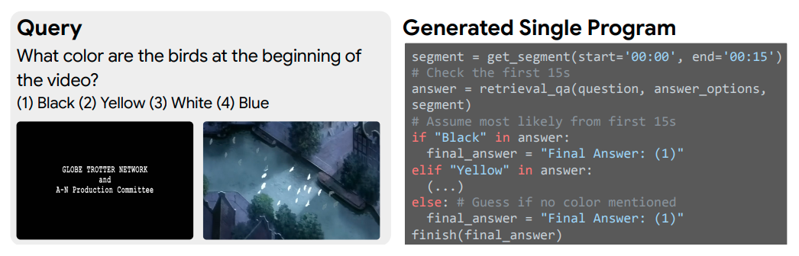

<!-- paginate: true -->

# あなたの知らない（かもしれない）エージェントの世界

大阪大学　基礎工学部　情報科学科
緒方　克哉

---
<!-- _header: Agenda -->
<!-- _class: agenda -->

1. LLMの限界とエージェントの台頭
1. End-to-End vs エージェント：アーキテクチャの比較
1. 研究最前線：自己進化と外部記憶
1. エージェントがもたらす新しい能力
1. まとめと今後の展望

---
<!-- _header: LLMの限界とエージェントの台頭 -->

## 単一LLMに"全部解かせる"ことの限界

| 問題 | 詳細 |
|------|------|
| **コンテキスト長の壁** | 長大な文書・履歴が入りきらない |
| **推論コスト** | 複雑なタスクほどトークン消費が爆発 |
| **幻覚 (Hallucination)** | 事実と創作の区別ができなくなる |
| **動的更新の難しさ** | 学習済みモデルは静的、世界は動的 |

---
<!-- _header: LLMの限界とエージェントの台頭 -->

## パラダイムシフト

**Before：** 巨大な脳を1つ作る

> Input → **巨大LLM（全部解かせる）** → Output

**After：** 小さな脳と道具を組み合わせたシステムを作る

> Input → **Planner** → **Coder** → **Tester** → **Reviewer** → Output
> （各エージェントは専門特化）

研究・開発における「AIエージェント」はいまここにいる

---
<!-- _header: End-to-End vs エージェント -->

## End-to-Endアプローチの"シンプルさ"

===={.image}

**しかし複雑な多段階タスクでは…**

> 仕様書 → 設計 → 実装 → テスト → レビューをすべて1回のプロンプトで解かせようとしている

---
<!-- _header: End-to-End vs エージェント -->

## 「1回のダイスで正解を当てる」問題

- ステップが増えるほど誤りが累積する
- 前のステップのエラーが後段に連鎖する
- どこで失敗したのか **デバッグできない**

| ステップ | 単体正解率 | 累積正解率 |
|---|---|---|
| Step 1: 設計 | 90% | 90% |
| Step 2: 実装 | 90% | 81% |
| Step 3: テスト | 90% | 73% |
| Step 4: レビュー | 90% | **65%** |

各ステップを独立させれば、それぞれ修正・再実行できる

---
<!-- _header: End-to-End vs エージェント -->

## マルチエージェント協調システム

**Planner** がタスクを分解 → 専門エージェントに委譲

- **Planner** → 問題を分析・サブタスクに分解
  - **Coder** → 実装を担当
  - **Tester** → テスト・検証を担当
  - **Reviewer** → 品質・正確性を担当

**ソフトウェアエンジニアリングのアナロジー**

| SW設計の概念 | エージェント設計 |
|---|---|
| マイクロサービス | 専門エージェント |
| 関心の分離 (SoC) | 各エージェントが単一責務 |
| オブジェクト指向 | エージェントのカプセル化 |

[4] Wu et al. AutoGen. arXiv:2308.08155　　[5] Hong et al. MetaGPT. ICLR 2024. arXiv:2308.00352
{.reference}

---
<!-- _header: 研究最前線：自己進化 -->

## Self-Evolving（自己進化）するエージェント

実行結果のフィードバックをもとに **自分自身を改善** する

1. タスク実行
2. 環境からフィードバック（コンパイルエラー・テスト失敗・ユーザー評価）
3. 自己評価・反省 ← **Reflexion**
4. プロンプト・戦略・内部状態を更新
5. 再実行 → より良い結果へ → **①に戻る**

静的なモデルが **実行時 (Runtime) に動的進化** する

[1] Shinn et al. Reflexion. NeurIPS 2023. arXiv:2303.11366　　[2] Zhou et al. Symbolic Learning Enables Self-Evolving Agents. arXiv:2406.18532
{.reference}

---
<!-- _header: 研究最前線：自己進化 -->

## Reflexion：自己反省による自律改善

<div style="display: flex; gap: 2em; align-items: flex-start;">
<div style="flex: 1;">

**Reflexion (Shinn et al., NeurIPS 2023)** の仕組み

1. タスクを実行する（Actor）
2. 結果を評価（Evaluator）
3. 「なぜ失敗したか」を言語化（Self-reflection）
4. 反省を長期記憶（Experience）に蓄積
5. 次の試行で参照 → 戦略を変える

> バグの振り返りをして次に活かすのと同じ

</div>
<div style="flex: 1;">



</div>
</div>

[1] Shinn et al. Reflexion: Language Agents with Verbal Reinforcement Learning. NeurIPS 2023. arXiv:2303.11366
{.reference}

---
<!-- _header: 研究最前線：外部記憶 -->

## 外部モジュールとしての記憶：MemAgent

**課題：** LLMのコンテキストウィンドウは有限　→　MemAgentはこれを**約437倍**に拡張

<div style="display: flex; gap: 2em; align-items: center;">
<div style="flex: 1.6;">



🔴 上：全トークンを一括処理 → コスト爆発・限界あり
🟢 下：チャンク単位で逐次処理・必要な情報だけ記憶・想起

</div>
<div style="flex: 1;">

| 指標 | 値 |
|---|---|
| 学習時コンテキスト | **8K** トークン |
| 対応可能コンテキスト | **3.5M** トークン |
| 拡張倍率 | **約437倍** |
| 3.5M での性能劣化 | **5%未満** |
| 512K RULER | **95%以上** の精度 |

</div>
</div>

[3] Yu et al. MemAgent: Reshaping Long-Context LLM with Multi-Conv RL-based Memory Agent. arXiv:2507.02259
{.reference}

---
<!-- _header: エージェントがもたらす新しい能力 -->

## ViperGPT：実行時コード生成と実行

**ViperGPT (Surís et al., ICCV 2023)** の衝撃

「画像の中の犬の数を数えて、左にいる猫との距離を計算して」

```python
# LLMが動的に生成するコード（擬似コード）
def execute(image):
    dogs = object_detector(image, "dog")
    cats = object_detector(image, "cat")
    
    left_cat = min(cats, key=lambda c: c.x)
    
    distances = [distance(dog, left_cat) for dog in dogs]
    
    return {
        "dog_count": len(dogs),
        "distances_to_left_cat": distances
    }

result = execute(image)
```

LLMは **「計算機」ではなく「コードを書く管制官（オーケストレーター）」** になる

[6] Surís et al. ViperGPT: Visual Inference via Python Execution for Reasoning. ICCV 2023. arXiv:2303.08128
{.reference}

---
<!-- _header: エージェントがもたらす新しい能力 -->

## CAViAR：Agentic Reasoning の進化

**CAViAR (Menon et al., 2025)** ─ ViperGPT 著者グループによる発展研究

<div style="display: flex; gap: 2em; align-items: center;">
<div style="flex: 1.6;">



🔵 左：動画に関する自然言語クエリ
🟢 右：LLMが動的に生成したPythonコードで推論

</div>
<div style="flex: 1;">

| | ViperGPT | CAViAR |
|---|---|---|
| 手順 | 固定 | **動的** |
| 対象 | 静止画 | **長尺ビデオ** |
| 自己評価 | なし | **Critic** |
| SOTA | ICCV'23 | LVBench等 |

</div>
</div>

[7] Menon et al. CAViAR: Critic-Augmented Video Agentic Reasoning. arXiv:2509.07680
{.reference}

---
<!-- _header: エージェントがもたらす新しい能力 -->

## 説明可能性（Explainability）としてのエージェント

**End-to-Endモデルの問題：ブラックボックス**

> Input → **[???]** → Output　← なぜこの答えが出た？追跡不能

**エージェント構成で得られるもの**

- **Planner**：「まず検索する」と決定
  - **Search Agent**：「論文X, Y, Zを取得」
    - **Coder**：「比較表を生成するコードを実行」
      - **Reviewer**：「内容を検証・修正」→ **最終出力**

- どのエージェントが何をしたか **完全にログで追跡**
- どこで間違えたか **ピンポイントでデバッグ**
- AIの推論プロセスを **エンジニアが監査・改善** できる

---
<!-- _header: まとめと今後の展望 -->

## エージェントの抽象的な役割

**インターフェースの抽象化**

> 自然言語（曖昧・柔軟）
> → **エージェント**
> → 構造化された世界（コード・API・DB・ツール）

自然言語と構造化された計算世界を繋ぐ **接着剤**

**動的なコンパイル**

不確実な環境（不完全な入力、動的に変わる環境情報）に対し
実行時にロジックを柔軟に組み立てる **Runtime 環境**

---
<!-- _header: まとめと今後の展望 -->

## エージェントはどこへ向かうか

**① 基礎モデルの低レイヤー化**

- LLM自体はより高速・安価な「推論エンジン」に
- 高度なロジックはエージェントフレームワーク（上位層）が担う

**② 永続性と自律性（Always-on）**

- **現在**：リクエスト → LLM → レスポンス（一発勝負）
- **近未来**：OSのバックグラウンドプロセスのように常に動き続け、勝手にタスクを最適化

---
<!-- _header: まとめと今後の展望 -->

## ③ MA4Science：科学的発見の自律化

**The AI Scientist (Sakana AI, 2024)** が証明したこと

> アイデア生成 → 実験コード生成・実行 → 結果可視化
> → 論文執筆 → 査読 を **LLMエージェントが完全自動化**
> 1論文あたりわずか **$15** で実行

**広がる応用領域**

- 材料科学・バイオ・創薬における仮説生成と検証
- 人間研究者は「方向性の設定」と「評価」に集中できる

> 「研究者の仕事がなくなる」のではなく
> **「研究のスループットが100倍になる」**

[8] Lu et al. The AI Scientist: Towards Fully Automated Open-Ended Scientific Discovery. Sakana AI, 2024. arXiv:2408.06292
{.reference}

---
<!-- _header: まとめと今後の展望 -->

## ④ Agent-based Simulation：社会・経済・サイバーの実験場

**Generative Agents (Park et al., Stanford, 2023)** の衝撃

- 25体のLLMエージェントに**個別のペルソナ・記憶・目標**を与える
- 「バレンタインパーティーを開け」という指示1つで
  → エージェントが**自律的に招待・関係形成・待ち合わせ**を創発

**なぜエンジニアが注目すべきか**

| 領域 | 応用 |
|---|---|
| 社会科学 | 政策変更が社会行動に与える影響のシミュレーション |
| 経済 | 市場・金融危機の創発メカニズムの研究 |
| サイバーセキュリティ | 攻撃者・防衛者エージェントによる脅威モデリング |

現実世界で「試せない実験」をエージェントで代替する

[9] Park et al. Generative Agents: Interactive Simulacra of Human Behavior. arXiv:2304.03442
{.reference}

---
<!-- _header: まとめ -->

- **LLMは「コンポーネント」** として設計する時代へ
- **マルチエージェント** = 関心の分離 × デバッグ可能性
- **Self-Evolving** = 実行時フィードバックで自律改善
- **外部記憶** = コンテキスト制約からの解放
- **ViperGPT** = LLMがオーケストレーターになる
- **Explainability** = エージェント構成で推論が追跡可能に

### AIを「使う」時代から「設計する」時代へ

---

<!-- _header: References -->

<small>

[1] Shinn et al. **Reflexion: Language Agents with Verbal Reinforcement Learning.** NeurIPS 2023. arXiv:2303.11366

[2] Zhou et al. **Symbolic Learning Enables Self-Evolving Agents.** arXiv 2024. arXiv:2406.18532

[3] Yu et al. **MemAgent: Reshaping Long-Context LLM with Multi-Conv RL-based Memory Agent.** arXiv 2025. arXiv:2507.02259

[4] Wu et al. **AutoGen: Enabling Next-Gen LLM Applications via Multi-Agent Conversation.** arXiv 2023. arXiv:2308.08155

[5] Hong et al. **MetaGPT: Meta Programming for A Multi-Agent Collaborative Framework.** ICLR 2024 (Oral). arXiv:2308.00352

[6] Surís et al. **ViperGPT: Visual Inference via Python Execution for Reasoning.** ICCV 2023. arXiv:2303.08128

[7] Menon et al. **CAViAR: Critic-Augmented Video Agentic Reasoning.** arXiv 2025. arXiv:2509.07680

[8] Lu et al. **The AI Scientist: Towards Fully Automated Open-Ended Scientific Discovery.** Sakana AI, 2024. arXiv:2408.06292

[9] Park et al. **Generative Agents: Interactive Simulacra of Human Behavior.** arXiv 2023. arXiv:2304.03442

</small>

---

# Q&A

ご清聴ありがとうございました
