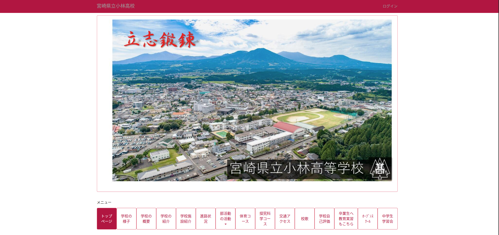
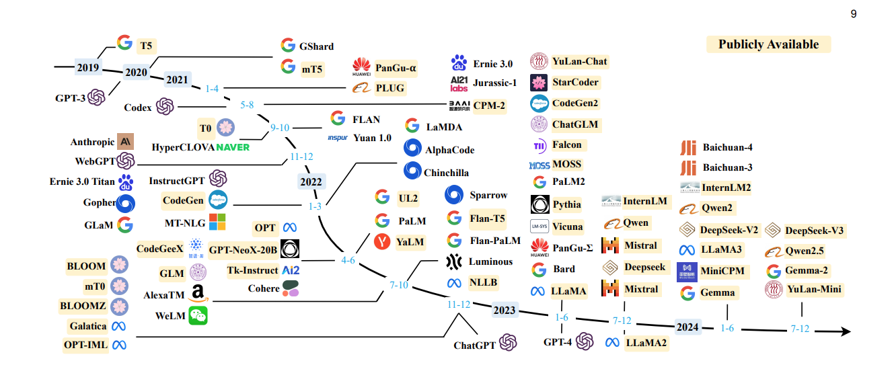
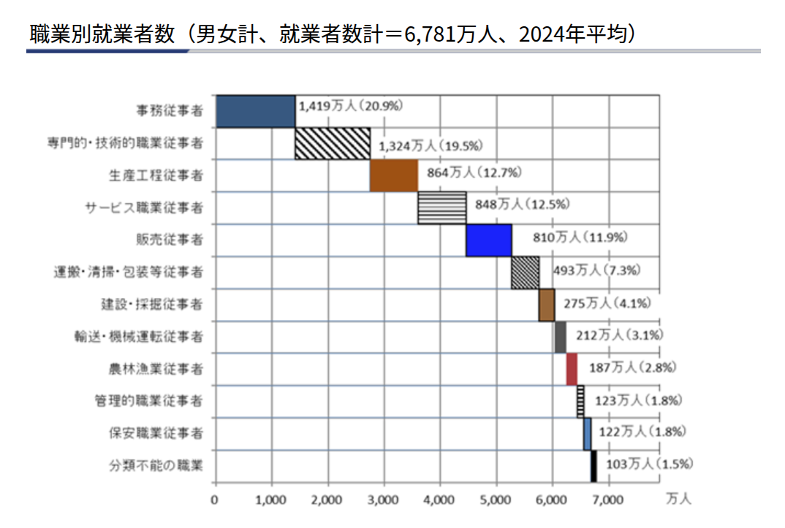

<!-- paginate: true -->

# 立志クラブ (2025/07/29)

大阪大学　基礎工学部　情報科学科B4
緒方　克哉

---
<!-- _header: Agenda -->

1. 自己紹介
1. 大学で何をやっているか
1. AIの進化
1. AIのちからを体験しよう
1. AI時代を生き抜くためのヒント
1. まとめ

---

<!-- _header: AIのちからを体験しよう -->

## AIに小林高校のウェブサイトを作ってもらおう

===={.image}
*[https://cms.miyazaki-c.ed.jp/6017/](https://cms.miyazaki-c.ed.jp/6017/)*{.citation}

---

<!-- _header: 自己紹介 -->

- 名前: 緒方　克哉　（おがた　かつや）
- 所属: 大阪大学 基礎工学部 情報科学科
- 趣味: 登山、映画鑑賞、旅行、サウナ
- 出身校：南小学校 -> 小林中学校 -> 小林高校探求科学コース

- 院試期間中で鬱です。。😔😩

---

<!-- _header: 大学で何をやっているか -->

- コンピュータサイエンス
    - コンピュータはどういう仕組みで動いているのか
    - プログラミング言語の作り方
    - ネットワークの仕組み　etc...
- 機械学習
    - 大規模言語モデル(LLM)の仕組み
    - LLMに視覚をつける試み(VLM)
    - 機械学習モデルの社会実装
        - 機械学習モデルを用いて、社会課題を解決すること
---

<!-- _header: AIの進化 -->

### AIの進化は凄まじい！！
- 日々世界中で様々な発見がなされている

===={.image}

*[https://arxiv.org/abs/2303.18223](https://arxiv.org/abs/2303.18223)*{.citation}

---
<!-- _header: AIの進化 -->

# AIサービス使ってますか？
- ChatGPT
- NotebookLM
- Gemini
- Claude

---

<!-- _header: AIのちからを体験しよう -->

# できあがったもの

---

<!-- _header: AI時代を生き抜くためのヒント -->

# AIにできること、できるようになること

- プログラミング
    - コーディング作業の自動化によるDXの超加速
- 事務作業全般
- ルールに則った作業(面倒だと感じる作業全般)
- ロボットを用いた自動化
    - 介護・医療
    - 飲食店の接客

---

<!-- _header: AI時代を生き抜くためのヒント -->

===={.image}

*[https://www.jil.go.jp/kokunai/statistics/chart/html/g0006.html](https://www.jil.go.jp/kokunai/statistics/chart/html/g0006.html)*{.citation}

---

<!-- _header: AI時代を生き抜くためのヒント -->

## 多分、AIにできないこと(最低でも向こう10年は。。。)

- 新たな課題の発見
- 人と人とのコミュニケーション
- 創造的な営み
    - 芸術
    - 新たなソリューションの発見

---

<!-- _header: AI時代を生き抜くためのヒント -->

# ん？課題？解決？コミュニケーション？。。。🤔🤔🤔🤔🤔

---

<!-- _header: AI時代を生き抜くためのヒント -->

##  課題研究だ！

- すべて課題研究で必要なこと
- 実際に人と対話をして、課題を見つけるところ
- その課題をどのように解決すればよいかを原因を深ぼって、深く深く考えること
- 実際に解決に至らなくても良いから、原因を究明し、解決策を模索することが大事

ex) 学校の廊下にゴミが落ちている -> ゴミ箱を増やす
- なぜゴミが落ちているのか？
- ゴミ箱の位置は適切か？
- そもそもゴミを捨てる意識が低いのでは？
- 清掃活動の仕組みに問題はないか？

---

<!-- _header: まとめ -->

- AIは急速に進化している
- AIにとって変わられないスキルを身につける
- そのために、課題研究を真面目に、楽しんでやろう
