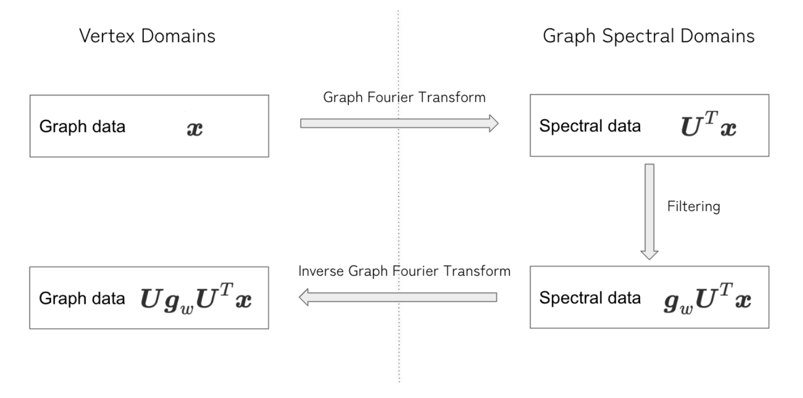
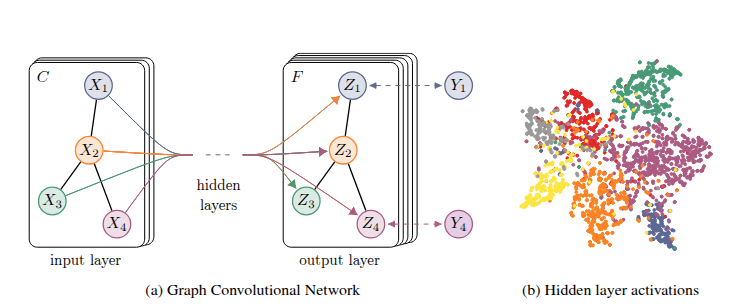
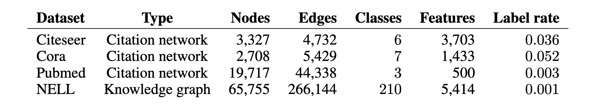
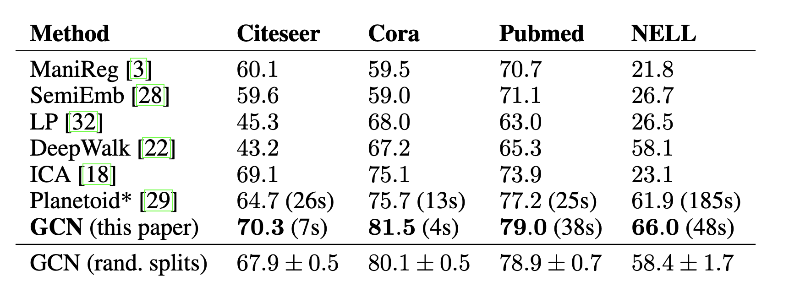
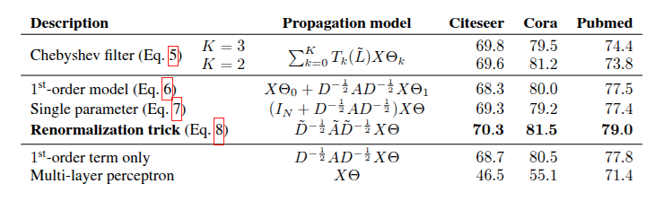
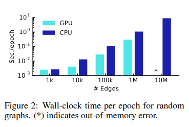

<!-- paginate: true -->

# GCNs

### Semi Supervised Classification with Graph Convolutional Networks

MIM Lab 
Katsuya Ogata

---

<!-- _header: Agenda -->

1. Basic Knowledge of GNN
1. Introduction
1. Fast Approximate Convolutions on Graphs
1. Semi-Supervised Node Classification
1. Related Work
1. Experiments
1. Results
1. Discussion

---

<!-- _header: Basic Knowledge of GNN -->

## Basic Elements of a Graph

- **Node**  
  A vertex in the graph, e.g., a user in a social network or an atom in a molecule.

- **Edge**  
  A connection between two nodes, e.g., friendship between users or bonds between atoms.

- **Adjacency Matrix**  
  A matrix representing the connectivity of nodes. If node $i$ and node $j$ are connected, $A_{ij} = 1$; otherwise, $0$.

---

<!-- _header: Basic Knowledge of GNN -->

## Graph Spectral Theory

- Study the properties of graphs by analyzing the **eigenvalues** and **eigenvectors** of matrices associated with the graph.

- Think of these eigenvalues as a kind of "fingerprint" or "signature" of the graph. They reveal crucial structural and global properties, such as:

  - Connectivity (how well the graph is connected)
  - Bipartiteness (if the graph can be divided into two independent sets)
  - The presence of certain motifs or communities

---

<!-- _header: Basic Knowledge of GNN -->

## Graph Laplacian

- **Definition**  
  $L := D - A$

  Where:  
  - $D$ = Degree matrix (diagonal, $D_{ii}$ = degree of node $i$)  
  - $A$ = Adjacency matrix

- **Properties**  
  - Symmetric (if undirected graph)  
  - Captures the difference between a node and its neighbors

---

<!-- _header: Basic Knowledge of GNN -->

## Normalized Laplacian

- **Definition**
  $\tilde{L} := D^{-1/2} L D^{-1/2} = I - D^{-1/2} A D^{-1/2} = I -\tilde{A}${.empty}

  Where:  
  - $\tilde{A} = D^{-1/2} A D^{-1/2}$ is the normalized adjacency

- **Why normalize?**  
  - Removes scale differences due to node degrees  
  - Makes it easier to compare graphs with different structures

---

<!-- _header: Basic Knowledge of GNN -->

## Graph Fourier Transform

- **Forward transform**  
  $$ F(x) = U^T x $$

- **Inverse transform**  
  $$ F^{-1}(x) = U x $$

Where:
- $U$: matrix of eigenvectors (graph Fourier basis)
- $x$: graph signal

For more details, refer to:  
[Shuman, D.I., Narang, S.K., Frossard, P., Ortega, A., Vandergheynst, P., 2013]

---

<!-- _header: Basic Knowledge of GNN -->

## Spectral Convolution

- **Definition (using Fourier domain):**  
  $$ g * x = F^{-1}(F(g) \odot F(x)) = U (U^T g \odot U^T x) $$

Where:
- $\odot$: element-wise multiplication
---

<!-- _header: Basic Knowledge of GNN -->

## Practical Filtering

- Direct use of $U^T g$ is often impractical.

- Instead, we typically use a **learnable diagonal matrix** $g_w$:
  $$ g_w * x = U g_w U^T x $$

This simplifies the filter design and makes learning scalable.

---

<!-- _header: Basic Knowledge of GNN -->

## Summary

1. Transform the graph signal \( x \) into the spectral domain
1. Apply a filter in the spectral domain
1. Return to the original space

===={.image}

---

<!-- _header: Basic Knowledge of GNN -->

## What is Semi-Supervised Learning?

- **Semi-Supervised Learning**  
  A learning setup where only a small portion of data points have labels, and the rest are unlabeled.

- Goal:  
  Use both labeled and unlabeled data to improve model performance.

---

<!-- _header: Introduction -->

## Loss Functions of GNN

$$
L = L_0 + \lambda L_{\text{reg}}
$$

where:  
- $L_0$ : supervised loss over the labeled part of the graph  
- $\lambda$ : weighting factor controlling the strength of the regularization  
- $L_{reg}$: graph regularization term
---

<!-- _header: Introduction -->

## Regularization Term

$$
L_{\text{reg}} = \sum_{i, j} A_{ij} \| f(X_i) - f(X_j) \|^2 = f(X)^\top \Delta f(X)
$$

where:  
- $f(\cdot)$: neural network-like differentiable function  
- $X$: matrix of node feature vectors $X_i$  
- $A$: adjacency matrix  
- $\Delta = D - A$: unnormalized graph Laplacian

---

<!-- _header: Introduction -->

## Homophily Hypothesis

- **Homophily** refers to the tendency of connected nodes to share similar attributes or labels.  
- In graph learning, it is assumed that:
  
  **"Connected nodes are likely to belong to the same class."**

---

<!-- _header: Introduction -->

## Proposed Methods

$$
loss = L_0
$$

$$
output = f(X, A)
$$

### Where:

- $X \in \mathbb{R}^{N \times D}$: Node feature matrix,  
  where $N$ = number of nodes, $D$ = number of features  
- $A \in \mathbb{R}^{N \times N}$: Adjacency matrix  
- $f(\cdot)$: Neural network mapping features and graph structure  
- $L_0$: Supervised loss on labeled nodes

---
<!-- _header: Fast Approximate Convolutions on Graphs -->

## Computational Cost Issues

$$g_\theta \star x = U g_\theta U^T x$$

1.  **Multiplication with eigenvector matrix $U$**:
    - Computational complexity is $O(N^2)$ ($N$: number of nodes)
    - Very expensive for large graphs

2.  **Eigendecomposition of graph Laplacian $L$**:
    - Necessary to obtain $U$ and $\Lambda$
    - Also computationally prohibitive for large graphs

---

<!-- _header: Fast Approximate Convolutions on Graphs -->

## Solution: Approximation via Chebyshev Polynomials

**Proposal by Hammond et al. (2011)**:
Approximate $g_\theta(\Lambda)$ by a truncated expansion in terms of Chebyshev polynomials $T_k(x)$ up to $K^{th}$ order.

**Approximation (Eq. 4):**
$$g_{\theta'}(\Lambda) \approx \sum_{k=0}^K \theta'_k T_k(\tilde{\Lambda})$$

---
<!-- _header: Fast Approximate Convolutions on Graphs -->

## Components of Eq. (4) and Chebyshev Polynomials

- **$\tilde{\Lambda}$ (Rescaled eigenvalues):**
    $$\tilde{\Lambda} = \frac{2}{\lambda_{max}}\Lambda - I_N$$
    - $\lambda_{max}$: Largest eigenvalue of $L$
    - The range of $\tilde{\Lambda}$ becomes $[-1, 1]$, matching the domain of Chebyshev polynomials.

- **$\theta' \in \mathbb{R}^K$**: Vector of Chebyshev coefficients (new learnable parameters)

- **Chebyshev polynomials $T_k(x)$:**
    - $T_0(x) = 1$
    - $T_1(x) = x$
    - $T_k(x) = 2xT_{k-1}(x) - T_{k-2}(x)$ (Recursive definition)

---

## Convolution using the Approximation

<!-- _header: Fast Approximate Convolutions on Graphs -->

Applying the approximation (Eq. 4) to the original convolution definition 
$g_\theta \star x = U g_\theta(\Lambda) U^T x$:

$$g_{\theta'} \star x \approx U \left( \sum_{k=0}^K \theta'_k T_k(\tilde{\Lambda}) \right) U^T x$$

$$g_{\theta'} \star x \approx \sum_{k=0}^K \theta'_k U T_k(\tilde{\Lambda}) U^T x$$

Using $T_k(\tilde{L}) = U T_k(\tilde{\Lambda}) U^T$, we get:

$$g_{\theta'} \star x \approx \sum_{k=0}^K \theta'_k T_k(\tilde{L})x$$

---
<!-- _header: Fast Approximate Convolutions on Graphs -->

**Important Properties:**
1.  **$K$-localized**:
    - $T_k(\tilde{L})$ is a $K^{th}$-order polynomial in the Laplacian.
    - The convolution result depends only on nodes that are at maximum $K$ steps away from the central node (Kth-order neighborhood).

2.  **Computational Complexity**:
    - Evaluating Eq. (5) is $O(|E|)$ ($|E|$: number of edges).
    - $T_k(\tilde{L})x$ can be computed efficiently through repeated sparse matrix-vector multiplications.

---
<!-- _header: Fast Approximate Convolutions on Graphs -->

## Approximation and Simplification

We approximate $\lambda_{max} \approx 2$ and $K=1$.(It is expected that neural network parameters will adapt to this change in scale during training.)

Under these approximations, Eq. 5 simplifies to:

$$g_{\theta'} \star x \approx {\theta'}_0 x + {\theta'}_1 (L-I_N)x$$
$$g_{\theta'} \star x = {\theta'}_0 x + {\theta'}_1 D^{1/2}AD^{1/2}x$$
$$g_{\theta'} \star x \approx \theta(I_N + D^{1/2}AD^{1/2})x$$

---
<!-- _header: Fast Approximate Convolutions on Graphs -->

## Renormalization Trick

To alleviate the problem of numerical instabilities, the following renormalization trick is introduced:

$$I_N + D^{-1/2}AD^{-1/2} \rightarrow \tilde{D}^{-1/2}\tilde{A}\tilde{D}^{-1/2}$$

Where:
- $\tilde{A} = A + I_N$ (Adjacency matrix with self-connections added)
- $\tilde{D}_{ii} = \sum_j \tilde{A}_{ij}$ (Degree matrix of $\tilde{A}$)

---
<!-- _header: Fast Approximate Convolutions on Graphs -->

## Generalization to Multiple Channels/Filters

This definition can be generalized for a signal $X \in \mathbb{R}^{N \times C}$ (with C input channels and F filters or feature maps) as follows:

$$Z = \tilde{D}^{-1/2}\tilde{A}\tilde{D}^{-1/2}X\Theta \quad (Eq. 8)$$

Where:
- $\Theta \in \mathbb{R}^{C \times F}$ is the matrix of filter parameters.
- $Z \in \mathbb{R}^{N \times F}$ is the convolved signal matrix.
- This filtering operation has a complexity of $O(|E|FC)$, as $\tilde{A}X$ can be efficiently implemented as a product of a sparse matrix with a dense matrix.

---

<!-- _header: Semi-Supervised Node Classification -->

## Two-Layer GCN

$$Z = f(X, A) = softmax((\hat{A}  ReLU(\hat{A}XW^{(0)})W^{(1)}))$$

Where:
- $\hat{A} = \tilde{D}^{1/2}A\tilde{D}^{1/2}$, $W^{(0)} \in R^{C \times H}$, $W^{(0)} \in R^{H \times F}${.empty}

===={.image}

---

<!-- _header: Semi-Supervised Node Classification -->

## Loss Function

Evaluate the cross-entropy error over all labeled examples：

$$L = -\sum_{l \in \mathcal{Y}_L} \sum_{f=1}^{F} Y_{lf} \ln Z_{lf} \quad (10)$$

**Explanation of symbols:**
- $\mathcal{Y}_L$: index set of labelled nodes
- $F$: number of output classes
- $Y_{lf}$: true label for class $f$ of node $l$.
- $Z_{lf}$: predicted probability for class $f$ of node $l$.

---

<!-- _header: Related Work -->

### Graph-Based Semi-Supervised Learning
#### Traditional Approaches
- **Graph Laplacian Regularization**: Label propagation, manifold regularization, deep semi-supervised embedding
- **Graph Embedding Methods**: DeepWalk, LINE, node2vec (skip-gram based with random walks)
- **Limitation**: Multi-step pipelines requiring separate optimization of each component

#### Recent Developments
- **Planetoid**: Injects label information during embedding learning process

---
<!-- _header: Related Work -->

### Neural Networks on Graphs
#### Early Work
- **Graph Neural Networks** (Gori et al., 2005): Recurrent networks with contraction maps
- **Modern Extensions** (Li et al., 2016): Advanced RNN training techniques

#### Convolution-Based Approaches
- **Spectral Methods** (Bruna et al., 2014): O(N²) complexity limitation
- **Localized Convolutions** (Defferrard et al., 2016): Fast Chebyshev polynomial approximation
- **Degree-Specific Weights** (Duvenaud et al., 2015): Scalability issues for wide degree distributions

---

<!-- _header: Experiments -->

## Experimental Overview

We test our GCN model in multiple scenarios:

- **Semi-supervised document classification** in citation networks
- **Semi-supervised entity classification** in bipartite graphs from knowledge graphs
- **Evaluation of various graph propagation models**
- **Runtime analysis** on random graphs

---
<!-- _header: Experiments -->

## Datasets Overview

===={.image}

**Label Rate**: Number of labeled nodes used for training / Total nodes

---
<!-- _header: Experiments -->

## Citeseer, Cora, and Pubmed (Citation networks)

**Structure:**
- **Nodes**: Documents
- **Edges**: Citation links (treated as undirected)
- **Features**: Sparse bag-of-words vectors
- **Adjacency Matrix**: Binary, symmetric

**Training Setup:**
- Only **20 labels per class** for training
- All feature vectors available
- Each document has a class label

---
<!-- _header: Experiments -->

## Knowledge Graph Structure (NELL)

**Original Format:**
- Entities connected with directed, labeled edges (relations)
- Example: (entity₁, relation, entity₂)

**Preprocessing:**
- Convert to bipartite graph: (e₁, r₁) and (e₂, r₂)
- **55,864 relation nodes** + **9,891 entity nodes**
- Extended features: **61,278-dim sparse vectors**

**Extreme Semi-supervised Setting:**
- Only **1 labeled example per class** (210 classes total)

---
<!-- _header: Experiments -->

## For Runtime Analysis (Random graphs)

**Generation Process:**
- N nodes → 2N edges assigned uniformly at random
- **Feature Matrix**: Identity matrix I_N (featureless approach)
- Each node represented by unique one-hot vector
- Dummy labels: Y_i = 1 for all nodes

**Purpose:** Measure training time per epoch across different graph sizes

---
<!-- _header: Experiments -->

## Model Configuration
- **Architecture**: 2-layer GCN (Section 3.1)
- **Test Set**: 1,000 labeled examples
- **Validation Set**: 500 labeled examples
- **Deeper Models**: Up to 10 layers (Appendix B)

## Training Parameters
- **Optimizer**: Adam (learning rate = 0.01)
- **Max Epochs**: 200
- **Early Stopping**: Window size = 10
- **Weight Initialization**: Glorot & Bengio (2010)

---
<!-- _header: Experiments -->

## Citation Networks
- Optimize on **Cora only**
- Apply same parameters to Citeseer and Pubmed

## Tuned Parameters
- **Dropout rate** (all layers)
- **L2 regularization factor** (first GCN layer)
- **Number of hidden units**

## Random Graphs
- Hidden layer size: **32 units**
- **No regularization** (no dropout, no L2)

---
<!-- _header: Experiments -->

## Model Baseline

### Traditional Graph-based Methods
- **LP**: Label Propagation (Zhu et al., 2003)
- **ManiReg**: Manifold Regularization (Belkin et al., 2006)
- **SemiEmb**: Semi-supervised Embedding (Weston et al., 2012)

### Embedding-based Methods
- **DeepWalk**: Skip-gram based graph embeddings (Perozzi et al., 2014)

### Classification Methods
- **ICA**: Iterative Classification Algorithm (Lu & Getoor, 2003)
- **Planetoid**: Best-performing variant (Yang et al., 2016)

---
<!-- _header: Experiments -->

## Iterative Classification Algorithm (ICA)

### Two-stage Process

1. **Local Classifier**: 
   - Train on labeled nodes using local features only
   - Bootstrap unlabeled nodes

2. **Relational Classifier**:
   - Use local features + aggregation operator
   - 10 iterations with random node ordering
   - Hyperparameters chosen via validation

**Note**: TSVM omitted due to scalability issues with large class numbers

---
<!-- _header: Experiments -->

## Key Experimental Highlights

### Comprehensive Evaluation
- **4 diverse datasets** spanning different domains
- **Multiple baseline comparisons** 
- **Runtime analysis** for scalability assessment

### Rigorous Methodology
- Same data splits as previous work (Yang et al., 2016)
- Proper validation methodology
- Fair comparison with state-of-the-art methods

**Next**: Results demonstrate significant improvements across all metrics

---

<!-- _header: Results -->

## Semi-Supervised Node Classification Results

===={.image}

### Training time until convergence shown in parentheses

---

<!-- _header: Results -->

## Propagation Model Evaluation

### Comparing Different Variants

===={.image}

---

<!-- _header: Results -->

### Renormalization Trick Superior
- **Best overall performance** across all datasets
- Balances efficiency and representation power

### Graph Structure Matters
- **MLP baseline** performs significantly worse
- Confirms importance of graph convolution operations

### Simpler Can Be Better
- **Renormalization trick** outperforms complex Chebyshev polynomials
- **Fewer parameters** → better generalization
- **Lower computational cost** → practical advantages

---

<!-- _header: Results -->

## Training Time Analysis

### Scalability on Random Graphs

===={.image}

### Key Finding
Linear scalability enables application to very large graphs

---

<!-- _header: Results -->

## Why GCN Works Better

### Methodological Advantages
- **Direct graph encoding** vs explicit regularization
- **Unified optimization** vs multi-step pipelines
- **Efficient propagation** vs expensive random walks

### Architectural Benefits
- **Localized convolutions** capture neighborhood structure
- **Parameter sharing** across graph structure
- **Renormalization trick** balances self vs neighbor information

---

<!-- _header: Discussion -->

## Semi-Supervised Model Analysis

### Why GCN Outperforms Traditional Methods

#### Graph-Laplacian Regularization Limitations
- **Assumption**: Edges encode mere similarity of nodes
- **Restriction**: Limited modeling capacity
- **Challenge**: Difficult to optimize multi-step pipeline

#### Skip-gram Based Method Limitations
- **Multi-step pipeline**: Each step optimized separately
- **Suboptimal**: Cannot achieve end-to-end optimization
- **Complexity**: Random walk generation + semi-supervised training

---

<!-- _header: Discussion -->

## Limitations and Future Work

### Memory Requirements
#### Current Challenge
- **Full-batch gradient descent**: Memory grows linearly with dataset size
- **Large graphs**: May not fit in GPU memory
- **CPU training**: Viable option but slower

#### Proposed Solutions
- **Mini-batch SGD**: Consider K-hop neighborhoods for K-layer GCN
- **Approximate methods**: For very large, densely connected graphs
- **Distributed training**: Scale to massive datasets

---

<!-- _header: Discussion -->

## Directed edges and edge features

#### Current Restrictions
- **Undirected graphs only**: Weighted or unweighted
- **No edge features**: Cannot naturally incorporate edge attributes

### Future Extensions
- **Native directed graph support**
- **Edge feature integration**
- **Heterogeneous graph handling**

---

<!-- _header: Discussion -->

## Current Limiting Assumptions

#### Locality Assumption
- **K-hop neighborhood**: Dependence limited to K layers
- **Fixed receptive field**: May be suboptimal for some graphs

#### Equal Importance Assumption
- **Self-connections vs neighbors**: Currently equal weight
- **Trade-off parameter**: Could be beneficial

### Proposed Enhancement
$$\tilde{A} = A + λI_N$$

- **λ**: Learnable trade-off parameter

---

<!-- _header: Conclusion -->

### Key Contributions
- **Novel scalable approach** for semi-supervised learning on graph-structured data
- **Efficient variant** of convolutional neural networks operating directly on graphs
- **First-order approximation** of spectral graph convolutions with linear O(|E|) scaling
- **Hidden representations** encoding both local graph structure and node features

---

<!-- _header: Appendix -->

## Spectral GNNs: Polynomial Filter Approximation

- **Sopectral Graph Convolution**: $g_w * x = U g_w U^T x$
- These models often use filters defined as a function of eigenvalues:  
  $g_w := g(\Lambda)$

- **Direct eigendecomposition is computationally expensive.**  
  To address this, the filter is expressed as a $K$-th order polynomial:
  $$
  g(\Lambda) = \sum_{k=0}^K w_k (I - \Lambda)^k
  $$
---

<!-- _header: Appendix -->

## Spectral GNNs: Polynomial Filter Approximation

- The convolution can then be rewritten as:
  $$
  U g(\Lambda) U^T X = \sum_{k=0}^K w_k \tilde{A}^k X
  $$
  where $\tilde{A} = D^{1/2}AD^{1/2}$ is the normalized adjacency matrix.

- **Key Points:**
  - Eigenvectors and eigenvalues disappear from the final expression.
  - The operation is now a sum of powers of the normalized adjacency matrix.
---

<!-- _header: Appendix -->

- Expanding the equation:
  $$
  U g(\Lambda) U^T X = U \left( \sum_{k=0}^K w_k (I - \Lambda)^k \right) U^T X
  $$
  $$
  = \sum_{k=0}^K w_k U (I - \Lambda)^k U^T X
  $$
  $$
  = \sum_{k=0}^K w_k (I - U \Lambda U^T)^k X
  $$
  $$
  = \sum_{k=0}^K w_k \tilde{A}^k X
  $$