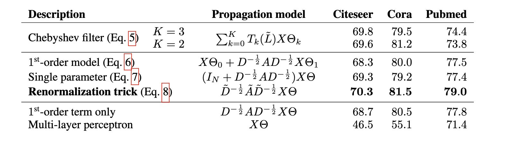
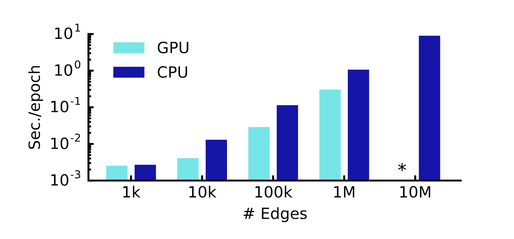

<!-- paginate: true -->

# GCNs

### Semi Supervised Classification with Graph Convolutional Networks

MIM Lab 
Katsuya Ogata

---

<!-- _header: Agenda -->

1. Basic Knowledge of GNN
1. Introduction
1. Fast Approximate Convolutions on Graphs
1. Semi-Supervised Node Classification
1. Experiments
1. Results
1. Discussion
1. Appendix
---

<!-- _header: Basic Knowledge of GNN -->

## Basic Elements of a Graph

- **Node**  
  A vertex in the graph, e.g., a user in a social network or an atom in a molecule.

- **Edge**  
  A connection between two nodes, e.g., friendship between users or bonds between atoms.

- **Adjacency Matrix**  
  A matrix representing the connectivity of nodes. If node $i$ and node $j$ are connected, $A_{ij} = 1$; otherwise, $0$.

---

<!-- _header: Basic Knowledge of GNN -->

## Graph Spectral Theory

- Study the properties of graphs by analyzing the **eigenvalues** and **eigenvectors** of matrices associated with the graph.

- We reveal crucial structural and global properties, such as:

  - Connectivity (how well the graph is connected)
  - Bipartiteness (if the graph can be divided into two independent sets)
  - The presence of certain motifs or communities

---

<!-- _header: Basic Knowledge of GNN -->

## Graph Laplacian

- **Definition**  
  $L := D - A$

  Where:  
  - $D$ = Degree matrix (diagonal, $D_{ii}$ = degree of node $i$)  
  - $A$ = Adjacency matrix

- **Properties**  
  - Symmetric (if undirected graph)  
  - Captures the difference between a node and its neighbors

---

<!-- _header: Basic Knowledge of GNN -->

## Normalized Laplacian

- **Definition**
  $\tilde{L} := D^{-1/2} L D^{-1/2} = I - D^{-1/2} A D^{-1/2} = I -\tilde{A}${.empty}

  Where:  
  - $\tilde{A} = D^{-1/2} A D^{-1/2}$ is the normalized adjacency

- **Why normalize?**  
  - Removes scale differences due to node degrees  
  - Makes it easier to compare graphs with different structures

---

<!-- _header: Basic Knowledge of GNN -->

## Graph Fourier Transform

- **Forward transform**  
  $$ F(x) = U^T x $$

- **Inverse transform**  
  $$ F^{-1}(x) = U x $$

Where:
- $U$: matrix of eigenvectors (graph Fourier basis)
- $x$: graph signal

---

<!-- _header: Basic Knowledge of GNN -->

## Spectral Convolution

- **Definition (using Fourier domain):**  
  $$ g * x = F^{-1}(F(g) \odot F(x)) = U (U^T g \odot U^T x) $$

Where:
- $\odot$: element-wise multiplication
---

<!-- _header: Basic Knowledge of GNN -->

## Practical Filtering

- Direct use of $U^T g$ is often impractical.

- Instead, we typically use a **learnable diagonal matrix** $g_w$:
  $$ g_w * x = U g_w U^T x $$

This simplifies the filter design and makes learning scalable.

---

<!-- _header: Basic Knowledge of GNN -->

## Summary

1. Transform the graph signal \( x \) into the spectral domain
1. Apply a filter in the spectral domain
1. Return to the original space

===={.image}

---

<!-- _header: Introduction -->

## Loss Functions of GNN

$$
L = L_0 + \lambda L_{\text{reg}}
$$

where:  
- $L_0$ : supervised loss over the labeled part of the graph  
- $\lambda$ : weighting factor controlling the strength of the regularization  
- $L_{reg}$: graph regularization term
---

<!-- _header: Introduction -->

## Regularization Term

$$
L_{\text{reg}} = \sum_{i, j} A_{ij} \| f(X_i) - f(X_j) \|^2 = f(X)^\top \Delta f(X)
$$

where:  
- $f(\cdot)$: neural network-like differentiable function  
- $X$: matrix of node feature vectors $X_i$  
- $A$: adjacency matrix  
- $\Delta = D - A$: unnormalized graph Laplacian

---

<!-- _header: Introduction -->

## Homophily Hypothesis

- **Homophily** refers to the tendency of connected nodes to share similar attributes or labels.  
- In graph learning, it is assumed that:
  
  **"Connected nodes are likely to belong to the same class."**

---

<!-- _header: Introduction -->

## Proposed Methods

$$
loss = L_0
$$

$$
output = f(X, A)
$$

### Where:

- $X \in \mathbb{R}^{N \times D}$: Node feature matrix,  
  where $N$ = number of nodes, $D$ = number of features  
- $A \in \mathbb{R}^{N \times N}$: Adjacency matrix  
- $f(\cdot)$: Neural network mapping features and graph structure  
- $L_0$: Supervised loss on labeled nodes

---
<!-- _header: Fast Approximate Convolutions on Graphs -->

## Computational Cost Issues

$$g_\theta \star x = U g_\theta U^T x$$

1.  **Multiplication with eigenvector matrix $U$**:
    - Computational complexity is $O(N^2)$ ($N$: number of nodes)
    - Very expensive for large graphs

2.  **Eigendecomposition of graph Laplacian $L$**:
    - Necessary to obtain $U$ and $\Lambda$
    - Also computationally prohibitive for large graphs

---

<!-- _header: Fast Approximate Convolutions on Graphs -->

## Solution: Approximation via Chebyshev Polynomials

**Proposal by Hammond et al. (2011)**:
Approximate $g_\theta(\Lambda)$ by a truncated expansion in terms of Chebyshev polynomials $T_k(x)$ up to $K^{th}$ order.

**Approximation (Eq. 4):**
$$g_{\theta'}(\Lambda) \approx \sum_{k=0}^K \theta'_k T_k(\tilde{\Lambda})$$

---
<!-- _header: Fast Approximate Convolutions on Graphs -->

## Components of Eq. (4) and Chebyshev Polynomials

- **$\tilde{\Lambda}$ (Rescaled eigenvalues):**
    $$\tilde{\Lambda} = \frac{2}{\lambda_{max}}\Lambda - I_N$$
    - $\lambda_{max}$: Largest eigenvalue of $L$
    - The range of $\tilde{\Lambda}$ becomes $[-1, 1]$, matching the domain of Chebyshev polynomials.

- **Chebyshev polynomials $T_k(x)$:**
    - $T_0(x) = 1$
    - $T_1(x) = x$
    - $T_k(x) = 2xT_{k-1}(x) - T_{k-2}(x)$ (Recursive definition)

---

## Convolution using the Approximation

<!-- _header: Fast Approximate Convolutions on Graphs -->

Applying the approximation (Eq. 4) to the original convolution definition 
$g_\theta \star x = U g_\theta(\Lambda) U^T x$:

$$g_{\theta'} \star x \approx U \left( \sum_{k=0}^K \theta'_k T_k(\tilde{\Lambda}) \right) U^T x$$

$$g_{\theta'} \star x \approx \sum_{k=0}^K \theta'_k U T_k(\tilde{\Lambda}) U^T x$$

Using $T_k(\tilde{L}) = U T_k(\tilde{\Lambda}) U^T$, we get:

$$g_{\theta'} \star x \approx \sum_{k=0}^K \theta'_k T_k(\tilde{L})x$$

---
<!-- _header: Fast Approximate Convolutions on Graphs -->

## Important Properties:
1.  **$K$-localized**:
    - $T_k(\tilde{L})$ is a $K^{th}$-order polynomial in the Laplacian.
    - The convolution result depends only on nodes that are at maximum $K$ steps away from the central node (Kth-order neighborhood).

2.  **Computational Complexity**:
    - Evaluating Eq. (5) is $O(|E|)$ ($|E|$: number of edges).
    - $T_k(\tilde{L})x$ can be computed efficiently through repeated sparse matrix-vector multiplications.

---
<!-- _header: Fast Approximate Convolutions on Graphs -->

## Approximation and Simplification

We approximate $\lambda_{max} \approx 2$ and $K=1$.(It is expected that neural network parameters will adapt to this change in scale during training.)

Under these approximations, Eq. 5 simplifies to:

$$g_{\theta'} \star x \approx {\theta'}_0 x + {\theta'}_1 (L-I_N)x$$
$$g_{\theta'} \star x = {\theta'}_0 x + {\theta'}_1 D^{1/2}AD^{1/2}x$$
$$g_{\theta'} \star x \approx \theta(I_N + D^{1/2}AD^{1/2})x$$

---
<!-- _header: Fast Approximate Convolutions on Graphs -->

## Renormalization Trick

To alleviate the problem of numerical instabilities, the following renormalization trick is introduced:

$$I_N + D^{-1/2}AD^{-1/2} \rightarrow \tilde{D}^{-1/2}\tilde{A}\tilde{D}^{-1/2}$$

Where:
- $\tilde{A} = A + I_N$ (Adjacency matrix with self-connections added)
- $\tilde{D}_{ii} = \sum_j \tilde{A}_{ij}$ (Degree matrix of $\tilde{A}$)

---
<!-- _header: Fast Approximate Convolutions on Graphs -->

## Generalization to Multiple Channels/Filters

$$Z = \tilde{D}^{-1/2}\tilde{A}\tilde{D}^{-1/2}X\Theta \quad (Eq. 8)$$

Where:
- $X \in \mathbb{R}^{N \times C}$ is the matrix of input graph signal.
- $\Theta \in \mathbb{R}^{C \times F}$ is the matrix of filter parameters.
- $Z \in \mathbb{R}^{N \times F}$ is the convolved signal matrix.
- This filtering operation has a complexity of $O(|E|FC)$, as $\tilde{A}X$ can be efficiently implemented as a product of a sparse matrix with a dense matrix.

---

<!-- _header: Semi-Supervised Node Classification -->

## Two-Layer GCN

$$H^{(l+1)} = \sigma(\tilde{D}^{1/2}\tilde{A}\tilde{D}^{1/2}H^{(l)}W^{(l)}) $$

$$Z = f(X, A) = softmax((\hat{A}  ReLU(\hat{A}XW^{(0)})W^{(1)}))$$

Where:
- $\hat{A} = \tilde{D}^{1/2}A\tilde{D}^{1/2}$, $W^{(0)} \in R^{C \times H}$, $W^{(0)} \in R^{H \times F}${.empty}

===={.image}

---

<!-- _header: Semi-Supervised Node Classification -->

## Loss Function

Evaluate the cross-entropy error over all labeled examples：

$$L = -\sum_{l \in \mathcal{Y}_L} \sum_{f=1}^{F} Y_{lf} \ln Z_{lf}$$

**Explanation of symbols:**
- $\mathcal{Y}_L$: index set of labelled nodes
- $F$: number of output classes
- $Y_{lf}$: true label for class $f$ of node $l$.
- $Z_{lf}$: predicted probability for class $f$ of node $l$.

---
<!-- _header: Experiments -->

## Datasets Overview

===={.image}

**Label Rate**: Number of labeled nodes used for training / Total nodes

---
<!-- _header: Experiments -->

## Citeseer, Cora, and Pubmed (Citation networks)

**Structure:**
- **Nodes**: Documents
- **Edges**: Citation links (treated as undirected)
- **Features**: Sparse bag-of-words vectors
- **Adjacency Matrix**: Binary, symmetric

**Training Setup:**
- Only **20 labels per class** for training
- All feature vectors available
- Each document has a class label

---
<!-- _header: Experiments -->

## Knowledge Graph Structure (NELL)

**Original Format:**
- Entities connected with directed, labeled edges (relations)
- Example: (entity₁, relation, entity₂)

**Preprocessing:**
- Convert to bipartite graph: (e₁, r₁) and (e₂, r₂)
- **55,864 relation nodes** + **9,891 entity nodes**
- Extended features: **61,278-dim sparse vectors**

**Extreme Semi-supervised Setting:**
- Only **1 labeled example per class** (210 classes total)

---
<!-- _header: Experiments -->

## For Runtime Analysis (Random graphs)

**Generation Process:**
- $N$ nodes → $2N$ edges assigned uniformly at random
- **Feature Matrix**: Identity matrix $I_N$ (featureless approach)
- Each node represented by unique one-hot vector
- Dummy labels: $Y_i = 1$ for all nodes

**Purpose:** Measure training time per epoch across different graph sizes

---
<!-- _header: Experiments -->

## Model Configuration
- **Architecture**: 2-layer GCN (Section 3.1)
- **Test Set**: 1,000 labeled examples
- **Validation Set**: 500 labeled examples for hyperparemeter optimization (dropout rate, the number of hidden units and L2 regularization factor)
- **Optimizer**: Adam (learning rate = 0.01)
- **Max Epochs**: 200
- **Learning Rate** 0.01
- **Early Stopping**: Window size = 10
- **Weight Initialization**: Glorot & Bengio (2010)

<!-- _header: Experiments -->

<!-- ## Iterative Classification Algorithm (ICA)

### Two-stage Process

1. **Local Classifier**: 
   - Train on labeled nodes using local features only
   - Bootstrap unlabeled nodes

2. **Relational Classifier**:
   - Use local features + aggregation operator
   - 10 iterations with random node ordering
   - Hyperparameters chosen via validation

**Note**: TSVM omitted due to scalability issues with large class numbers -->

---

<!-- _header: Results -->

## Semi-Supervised Node Classification Results

===={.image}

---

<!-- _header: Results -->

## Propagation Model Evaluation

### Comparing Different Variants

===={.image}

<!-- --- -->

<!-- _header: Results -->

<!-- ### Renormalization Trick Superior
- **Best overall performance** across all datasets
- Balances efficiency and representation power

### Graph Structure Matters
- **MLP baseline** performs significantly worse
- Confirms importance of graph convolution operations

### Simpler Can Be Better
- **Renormalization trick** outperforms complex Chebyshev polynomials
- **Fewer parameters** → better generalization
- **Lower computational cost** → practical advantages -->

---

<!-- _header: Results -->

## Training Time Analysis

===={.image}

### Key Finding
Linear scalability enables application to very large graphs

---

<!-- _header: Discussion -->

## Why GCN Outperforms Traditional Methods

#### Graph-Laplacian Regularization Limitations
- **Assumption**: Edges encode mere similarity of nodes
- **Restriction**: Limited modeling capacity
- **Challenge**: Difficult to optimize multi-step pipeline

#### Skip-gram Based Method Limitations
- **Multi-step pipeline**: Each step optimized separately
- **Suboptimal**: Cannot achieve end-to-end optimization
- **Complexity**: Random walk generation + semi-supervised training

---

<!-- _header: Discussion -->

## Limitations and Future Work

### Memory Requirements
- Mini-batch SGD, Approximate methods, Distributed training

### Directed edges and edge features
- Native directed graph support, Edge feature integration, Heterogeneous graph handling

### Current Limiting Assumptions
$$\tilde{A} = A + λI_N$$

- **λ**: Learnable trade-off parameter
<!-- 
---

# Appendix

---

<!-- _header: Related Work -->

<!-- ## Graph-Based Semi-Supervised Learning
- **Traditional**: Graph Laplacian regularization, graph embedding (DeepWalk, etc.). Multi-step pipelines were a limitation.
- **Recent**: Planetoid injects label info during embedding.

## Neural Networks on Graphs
- **Early Work**: Graph Neural Networks (Gori et al., 2005)
- **Convolution-Based**:
    - Spectral Methods (Bruna et al., 2014): O($N^2$) complexity.
    - Localized Convolutions (Defferrard et al., 2016): Fast Chebyshev approximation.
    - Degree-Specific Weights (Duvenaud et al., 2015): Scalability issues for wide degree distributions. --> -->