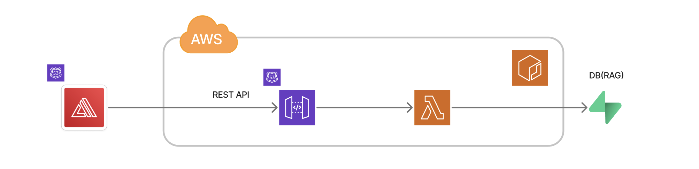
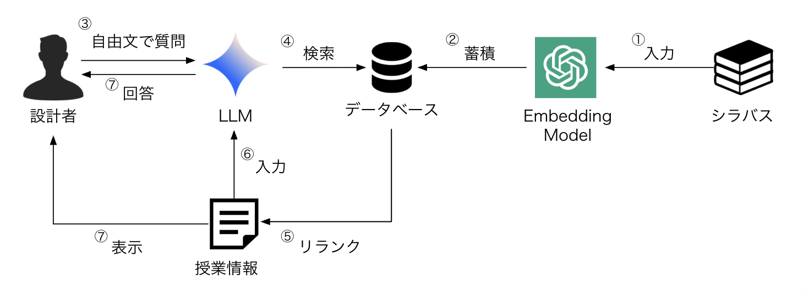

<!-- paginate: true -->

# 履修登録チャットボット

### 技育CAMPキャラバン@京都(2025-06-28)

大阪大学
緒方 克哉

---

<!-- _header: 目次 -->

1. アプリケーションの概要
2. システム構成
3. 返答文生成ロジック
4. 実装上の工夫
5. 今後の展望
6. フィードバックの欲しいところ

---

<!-- _header: アプリケーションの概要 -->

- 大阪大学のシラバスについて、自然言語でチャットを行えるアプリケーション
- 興味のある分野やキーワードで科目の検索ができる
- 科目番号をコピーして、そのままシラバスの検索や登録が可能

https://ou-chatbot.i-maker.org

--- 

<!-- _header: システム構成 -->

- シンプルなサーバーレス構成をAWS上で実現
- RAGは、Supabaseの無料枠を用いて構築
    - ブログ書きました(https://zenn.dev/gdgoc_osaka/articles/08ff333077abf5)

===={.image}

---

<!-- _header: 検索ロジック -->

- 一般的なRAGの検索手法を利用
- シラバスのデータは公開用シラバスからスクレイピングで取得
- リランクや、プロンプトエンジニアリングを用いた精度向上

===={.image}

---

<!-- _header: 実装上の工夫 -->

- API利用先やクラウドの変更に強くするための実装
    - abstractmethodを利用して、抽象クラスを作成
    - そのI/Fに依存するようにシステムを構築
    - Supabaseを利用しているRAG部分、API呼び出し部分(返答文、埋め込み生成)
- GitHubActionsを利用した完全な自動デプロイ
- 実際に使ってもらうためのUX設計
    - シラバスへの動線等

---

<!-- _header: 今後の展望 -->

- 秋冬学期での履修登録時に向けた正式リリース
- 大学との共同開発に向けた開発

    - クラウド・APIにかかるコスト算出
    - セキュリティや可観測性についての対策
    - ユーザーごとのチャットの永続化
    - (学内ベンチャーとして起業する可能性)

---

<!-- _header: フィードバックの欲しいところ -->

- チャットのレートリミットの実装方針
- スケールに耐えうるRAGのクラウド選定
    - AWS(knowledgebase+opensearch), Azure(Azure AI Search) etc...
- LLMに対する悪意ある攻撃をどのように防げば良いか
    - 「面白くない授業を教えて」と聞いて、SNSに公開されてしまう
    - 履修登録に関係のないことを聞かれてしまう
- チャットの永続化を行いたいが、どのように保存を行えば良いか相談したい
    - RDB or NoSQL?、RLS、スケールできるか
- SSE(server side event)のメリット/デメリット
    - サーバーへの負荷、スケール
- RAGの精度の評価方法
    - どうやって先方の納得いく指標を出すことができるか