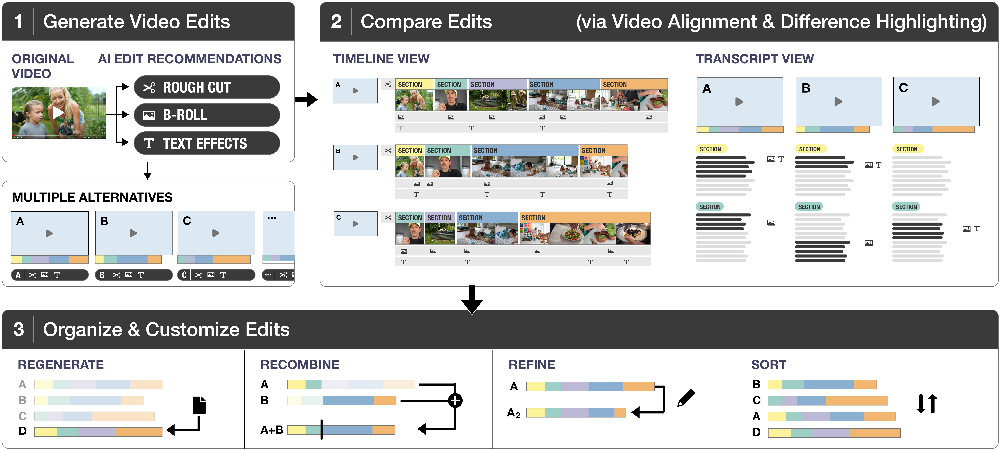
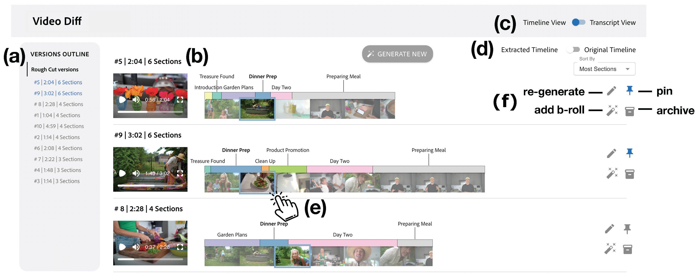
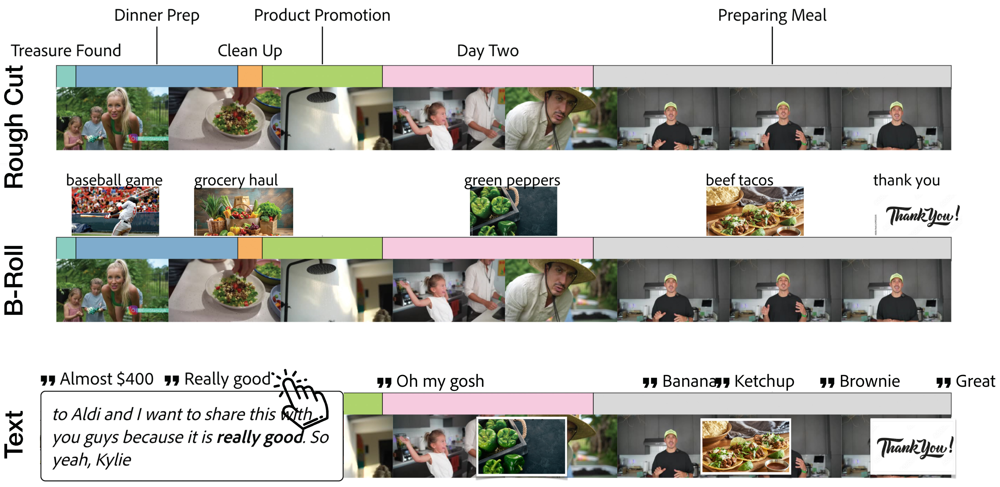
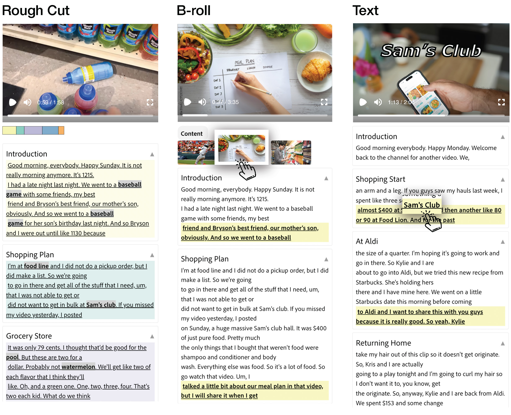
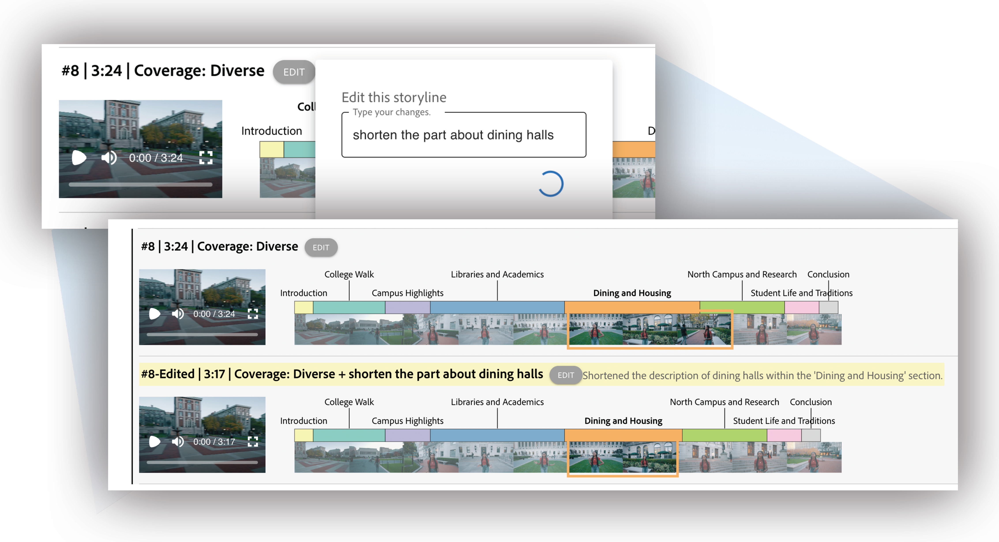
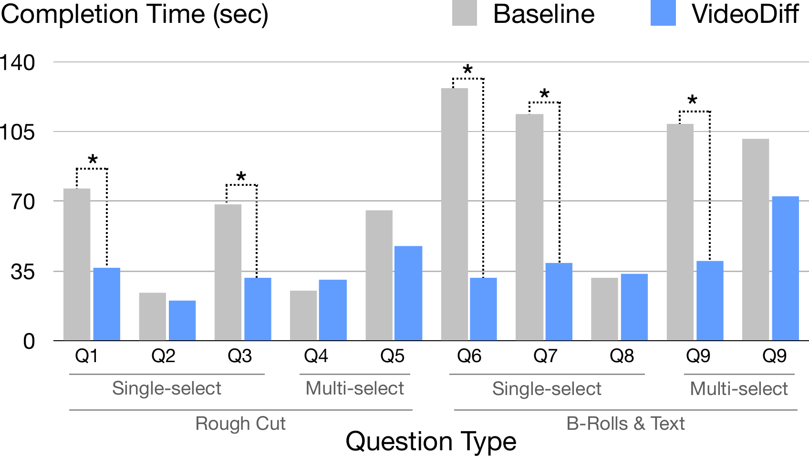
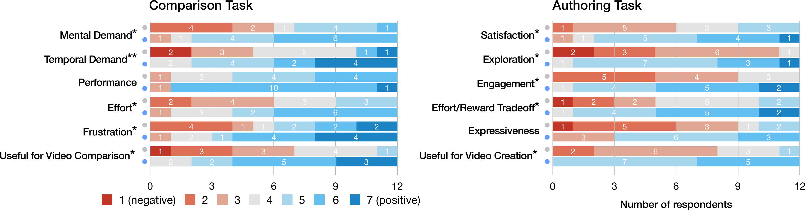

<!-- paginate: true -->

# VideoDiff

### Human-AI Video Co-Creation with Alternatives

CHI 2025 | Huh, Li, Pimmel, Shin, Pavel, Dontcheva (UT Austin & Adobe Research)

MIM Lab — Katsuya Ogata

<!-- 
本日はCHI 2025で発表されたVideoDiffという論文を紹介します。著者はUT AustinとAdobe Researchの研究者6名です。では早速始めます。
-->

---
<!-- _header: Agenda -->
<!-- _class: agenda -->

1. Background: What Makes a Good Video Edit?
1. Problem: Comparing AI-Generated Alternatives
1. Proposed Method: VideoDiff
1. Evaluation
1. Results
1. Limitations & Future Work

<!-- 
流れとしては、まず良い動画編集とは何かという背景から入って、AIが複数案を生成する時代の問題点、提案システムのVideoDiff、評価、結果、最後にLimitationという順番でお話しします。
-->

---
<!-- _header: Background -->

## What Makes a Good Video Edit?

| Dimension | Key Question | Real Example of a Bad Edit |
|---|---|---|
| **① Story Coverage** | Are key moments included? | *"yolk separation step is not included"* |
| **② Visual Presentation** | Do B-rolls & text effects match narration? | *"Too many text effects"* |
| **③ Technical Quality** | Are there any edit errors? | *"mid-sentence jumps, flash frames"* |

 

> *"I cannot focus on multiple aspects at once while reviewing. When I'm checking the colors, I only look at colors."* — P5 (Professional Editor)

<!-- 
まず背景として、良い動画編集とはどういうものかを整理します。

著者らはN=8のプロ編集者に複数の動画を実際に比較してもらい、そのときのメモを分析しました。そこから浮かび上がってきたのがこの3つの次元です。

ひとつめはストーリー・カバレッジ。重要なシーンが含まれているかどうかで、例えば料理動画で卵黄の分離工程が抜けていた、という具体的な声が出ています。

ふたつめは視覚的な演出。Bロールやテキストエフェクトがナレーションのトーンに合っているか。テキストエフェクトが多すぎる、という指摘がありました。

みっつめは技術的品質。文の途中でシーンが切り替わるジャンプカットや、フラッシュフレームといった編集エラーがないか。

そしてここで引用しているP5の発言が示すように、プロでもこれらの観点を同時に見ることはできません。一度に複数の軸を比較できないので、何度も見直す必要があり、これが時間コストの根本原因になっています。
-->

---
<!-- _header: Background -->

## No Single "Correct" Edit Exists

 

| Context / Purpose | What "Good" Means |
|---|---|
| **Social Media Short** | Short length, strong opening hook |
| **Educational Video** | Full coverage of all topics, logical order |
| **Commercial / Ad** | Brand consistency, A/B test variants |
| **Documentary** | Long-form, narrative coherence |

 

### → Comparing **multiple alternatives** is essential to finding the best fit

<!-- 
さらに重要なのは、良い編集に「正解」がないということです。

SNS向けのショート動画なら冒頭のフックが最優先ですし、教育動画ならトピックの網羅性、広告ならA/Bテスト用の複数バリエーション、ドキュメンタリーなら長尺でのナラティブの一貫性が求められます。

インタビューでもP5が「クライアントは3つのバージョンを見たがるが、作るのに時間がかかりすぎる」と話しており、複数案を提示したいけれど現実的に難しいという声が多くありました。

つまり、良い動画を作るためには複数の選択肢を比較することが本質的に必要で、それを効率よく行える仕組みが求められています。
-->

---
<!-- _header: Problem -->

## AI Can Now Generate Multiple Video Variations

**CapCut**

**OpusClip**

 

### → One click generates **10+ different edited videos**

<!-- 
そこで登場したのが、AIによる自動生成です。CapCutやOpusClipといったツールは今やワンクリックで10本以上の異なる編集バリエーションを自動生成できます。複数案を提示するという理想は技術的には実現できるようになりました。しかしここで新たな問題が生まれます。
-->

---
<!-- _header: Problem -->

## Comparing Videos Is Inherently Hard

| | Text / Image | **Video** |
|---|---|---|
| Comparison method | Side-by-side at a glance | **Must watch sequentially** |
| Spotting differences | Instant | **Requires full playback** |
| Comparing 10 candidates | Seconds | **Tens of minutes** |
| Cognitive load | Low | **High** |

 

> *"10 is a lot to compare at once. I need to take notes."* — P12

<!-- 
その問題が、動画の比較の難しさです。

テキストや静止画なら並べて一瞬で見比べられますが、動画は時間軸を持つメディアなので、違いを確認するには最初から最後まで見る必要があります。10本のバリエーションを比較しようとすると、それだけで数十分かかります。

著者らがFormative Studyで観察したところ、参加者全員が比較に非常に時間がかかると指摘し、7名がメモを取りながら見ており、5名は倍速再生や早送りといったワークアラウンドを使っていました。

P12の「10本は多すぎてメモが必要」という発言がこの状況をよく表しています。AIが複数案を生成できても、それを効率よく比較する手段がなければ、かえってクリエイターの負担が増えてしまうわけです。
-->

---
<!-- _header: Background: Formative Study -->

## Formative Study with Professional Editors (N=8)

**Method:** Semi-structured interviews + comparison task (3 edited versions of same footage)

| Design Goal | Description |
|---|---|
| **D1** | Minimize redundant watching by **aligning** variations |
| **D2** | Support quick skimming by **highlighting differences** |
| **D3** | Enable **independent** comparison per editing stage |
| **D4** | Support comparison via **multiple modalities** (timeline, transcript, preview) |
| **D5** | Support **verification** of edit suggestions *(future work)* |
| **D6** | Support **management & customization** of variations |

<!-- 
このような課題を踏まえて著者らはFormative Studyを行いました。平均10年以上のキャリアを持つプロ編集者8名に対して、半構造化インタビューと、同じ素材から作られた複数の編集動画を比較するタスクをお願いしました。

そこから導出されたのがこの6つの設計目標です。D1はバリエーションを同じ時間軸でアラインすること、D2は差分をひと目で分かるようにハイライトすること、D3はRough Cut・Bロール・テキストという編集ステージごとに独立して比較できること、D4はタイムライン・文字起こし・動画プレビューという複数の視点を組み合わせること。D5の編集エラーの自動検証は今回は未実装で将来課題です。D6はバリエーションを管理・カスタマイズする機能です。VideoDiffはこれらを実現するシステムとして設計されています。
-->

---
<!-- _header: Proposed Method: VideoDiff -->

## VideoDiff — Overview

===={.image}

<!-- 
これがVideoDiffの全体像です。大きく3つのフェーズがあります。まずAIがRough Cut・Bロール・テキストエフェクトそれぞれについて複数のバリエーションを生成し、次にタイムラインや文字起こしで差分を視覚化して効率よく比較でき、最後に絞り込んだ上でRefine・Regenerate・Recombineによってカスタマイズできます。では各機能を順番に見ていきます。
-->

---
<!-- _header: Proposed Method: VideoDiff -->

## System Overview

===={.image}

<!-- 
インターフェース全体はこのような構成になっています。左側にバリエーションの一覧があり、ソートやピン留め、アーカイブができます。中央がタイムラインか文字起こしビューで、右側が動画プレビュープレイヤーです。

動画をアップロードするとWhisperで文字起こしが行われ、GPT-4oが編集提案を生成します。まずRough Cutの10案が生成され、選んだ案をベースにBロールの10案、さらにテキストエフェクトの10案という3段階のフローになっています。
-->

---
<!-- _header: Proposed Method: VideoDiff -->

## Timeline View

===={.image}

<!-- 
タイムラインビューがD1・D2を実現するコア機能です。

全バリエーションのタイムラインが同じ時間軸で縦に並んでいるので、どのシーンがどのバリエーションに含まれているかが一目でわかります。

EditedビューとSourceビューを切り替えることもできて、Sourceビューでは元の素材のどの部分を使っているかが背景に表示されます。参加者がFormative Studyで元素材と見比べていたという観察がここに反映されています。

また各編集ステージを独立して比較できるのがD3です。Rough CutだけをまずじっくりとCompareして決めたら、次にBロール、という形でフォーカスを分けて進められます。
-->

---
<!-- _header: Proposed Method: VideoDiff -->

### Transcript View — Side-by-Side Text Comparison (D2, D4)

===={.image}

<!-- 
もうひとつの比較手段が文字起こしビューです。複数バリエーションの文字起こしを横並びで表示して、スクロールも同期されるのでずれなく比較できます。

視覚的に具体性の高いキーワードはボールドでハイライトされており、全文を読まなくても内容を素早くスキミングできます。

ユーザースタディでP17が言っていたのですが、「タイムラインは動画の骨格を決めるのに使い、文字起こしは細部の確認に使う」という使い分けが自然と生まれていました。この2つを組み合わせることでD4のマルチモーダルな比較が実現されています。
-->

---
<!-- _header: Proposed Method: VideoDiff -->

## Customization — Refine, Regenerate, Recombine

===={.image}

<!-- 
比較して気に入ったものがなければ、カスタマイズできます。

Regenerateは新しいテキストプロンプトで全く新しいバリエーションを生成します。Refineは既存のバリエーションを自然言語で修正するもので、例えば「食料品の話をしている部分をもっと短くして」といった指示ができます。Recombineは複数のバリエーションを組み合わせるもので、「3番のBロールの最初2枚と7番の最後の1枚を組み合わせて」というような指定ができます。

変更後はAIが具体的に何が変わったかをサマリーしてくれるので、再生して確認する手間が省けます。
-->

---
<!-- _header: Evaluation -->

## User Study Design

| | Details |
|---|---|
| **Participants** | N=12 (Proficient: 6, avg. 8.3 yrs; Beginner: 6, avg. 3.8 yrs) |
| **Design** | Within-subjects (each participant tried both conditions) |
| **Conditions** | VideoDiff vs. Baseline (CapCut / OpusClip-style) |
| **Task 1: Comparison** | Answer 10 questions about 10 video variations (3-min limit/question) |
| **Task 2: Authoring** | Create a final video using the system |
| **Materials** | YouTube grocery haul videos (V1: 12:41, V2: 13:10) |
| **Order** | Counterbalanced assignment of conditions and videos |

<!-- 
評価はWithin-subjects設計で行いました。参加者は熟練者6名・初心者6名の計12名で、VideoDiffとベースラインの両方を体験してもらっています。

ベースラインはCapCutやOpusClipに近いUIで、10本の動画を一覧できてソートはできますが、差分の可視化や横断比較の機能はありません。

タスクは2種類です。比較タスクでは10本の動画を見ながら1問3分以内で10問に答えます。制作タスクでは実際に最終動画を作ってもらいました。素材はYouTubeのGrocery Haul動画を使用しています。
-->

---
<!-- _header: Results -->

## Comparison Task: VideoDiff Halves Completion Time

===={.image}

> *"In only three minutes? I'll just have to guess as I cannot watch all these videos."* — P16 (Baseline)

<!-- 
比較タスクの結果がこちらです。グレーがベースライン、青がVideoDiffです。

1問あたりの平均回答時間は、ベースラインの74秒に対してVideoDiffは38秒と約半分になりました。特にQ6やQ7のような複数箇所を確認する問題での差が顕著です。

ベースラインでは8名が3分以内に正答を見つけられず、5名が推測に切り替えています。P16の「3分じゃ全部見れないから推測するしかない」という発言がその状況をよく表しています。

精度の平均もベースラインの0.66に対してVideoDiffは0.93と大幅に向上しています。認知負荷についてもMental DemandやEffort、FrustrationといったNASA-TLXの指標が有意に低くなりました。
-->

---
<!-- _header: Results -->

## Authoring Task: Higher Satisfaction & Creativity

===={.image}

<!-- 
制作タスクの結果がこちらです。左側が比較タスク、右側が制作タスクの結果で、上がベースライン、下がVideoDiffです。青寄りほど高評価です。

重要な発見として、ベースラインでは10本のバリエーションに圧倒されると感じた参加者が4名いましたが、VideoDiffでは全員がその圧倒感を感じなかった。P14は「ベースラインのときは10本は多すぎると思ったのに、VideoDiffだと差分が見えるから同じ10本でも全然多く感じなかった」と言っています。

動画の満足度、探索性、エンゲージメント、有用性のすべての指標でVideoDiffが有意に優れており、特に有用性は3.25から5.42へと大きく向上しました。
-->

---
<!-- _header: Limitations & Future Work -->

| Category | Issue |
|---|---|
| **AI Hallucination** | AI claims edits were applied, but they are not reflected in the video |
| **Visual Fine Detail** | Short-duration objects missed by periodic filmstrip sampling (5 users failed Q5) |
| **Edit Verification (D5)** | Not implemented — detecting errors like jump cuts automatically |
| **Personalization** | System does not learn from user's selection history |
| **Long-form Video** | Not tested on documentaries or longer footage (1+ hour) |
| **Transcript-only Users** | Some users never switched from transcript view — modality preference varies |

<!-- 
Limitationsもいくつかあります。

最も重大なのがAI幻覚です。P9が「フラッシュのある映像を除いて」と指示したところ、AIは除いたと応答したのに実際には残っていた、というケースがありました。現在のLLMは動画の内容を実際に確認せずに応答してしまうため、こうした齟齬が起きます。

次に、フィルムストリップは一定間隔でフレームを取得するため、一瞬しか映らないオブジェクトが見逃されることがあります。Q5のはさみの問題で5名が誤答したのはこれが原因です。

また、ジャンプカットの自動検出などD5の編集検証機能は未実装、個人化機能もなく毎回ゼロから選ぶ必要があります。使用した素材は12〜13分の動画で、ドキュメンタリーのような長尺動画での検証は今後の課題です。
-->

---
<!-- _header: Conclusion -->

## Key Takeaways

**Problem:** AI generates multiple video alternatives, but comparing them is tedious and cognitively demanding

**Proposed:** VideoDiff — a human-AI co-creation tool with difference visualization

**Key Features:**
- Timeline view: aligned variations with color-coded sections
- Transcript view: side-by-side keyword-highlighted comparison
- Customization: Refine / Regenerate / Recombine

**Results (N=12, within-subjects):**

| | Baseline → VideoDiff |
|---|---|
| Comparison time | 74 sec → **38 sec** (×0.5) |
| Cognitive load | Significantly reduced (*p* < 0.05) |
| Video satisfaction | Significantly improved (*p* < 0.05) |

<!-- 
まとめです。AIが複数の動画バリエーションを生成できるようになった一方、それを比較することが新たな負担になっていました。VideoDiffはタイムラインと文字起こしによる差分の可視化、そしてRefine・Regenerate・Recombineによるカスタマイズを組み合わせることで、比較時間を半減させ、認知負荷を下げ、制作満足度を向上させました。

この「比較中心の設計」という考え方は動画に限らず、文書やコード、デザインなど、AIが複数案を生成するあらゆるドメインに応用できる重要な知見だと思います。以上です。ご清聴ありがとうございました。
-->
